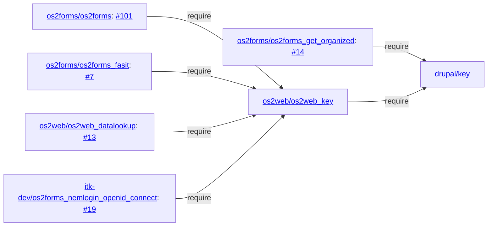

# Keys

## Usage

### Certificate and passphrase

* <http://selvbetjening.local.itkdev.dk/admin/config/system/os2web-datalookup/datafordeler-cvr>
* <http://selvbetjening.local.itkdev.dk/admin/config/system/os2web-datalookup/serviceplatformen-cpr-extended>
  * What about all the UUIDs?
* <http://selvbetjening.local.itkdev.dk/admin/os2forms_digital_post/settings>
* <http://selvbetjening.local.itkdev.dk/admin/os2forms_fasit/settings>
  - Is `Fasit API tenant` a secret?

### Username and passphrase

* <http://selvbetjening.local.itkdev.dk/admin/os2forms_get_organized/settings>

### OpenID Connect (OIDC)

* <http://selvbetjening.local.itkdev.dk/admin/config/system/os2web-nemlogin/openid-connect-nemlogin>
  * <http://selvbetjening.local.itkdev.dk/os2forms_nemlogin_openid_connect/authenticate/{id}>
  * <http://selvbetjening.local.itkdev.dk/admin/os2forms_nemlogin_openid_connect/settings>

* FBS?!

## Not our modules

* <http://selvbetjening.local.itkdev.dk/admin/config/people/openid-connect/generic/edit>
  * We can use the key module to inject `Client ID` and `Client secret`, cf.

    ```php
    # web/sites/default/settings.local.php
    $config['openid_connect.client.generic']['settings']['client_id'] = 'mock-idp-admin';
    $config['openid_connect.client.generic']['settings']['client_secret'] = 'mock-idp-admin-secret';
    ```

## Test certificates

```shell name=create-test-certificates
# p12 with password
openssl req -x509 -newkey rsa:4096 -days 365 -subj "/CN=example.com" -passout pass:test -keyout cert/test.key -out cert/test.crt
openssl pkcs12 -export -out cert/test.p12 -passin pass:test -passout pass:test -inkey cert/test.key -in cert/test.crt
openssl pkcs12 -in cert/test.p12 -passin pass:test -noenc

# p12 without password
openssl req -x509 -newkey rsa:4096 -days 365 -subj "/CN=example.com" -passout pass:''   -keyout cert/test_no_password.key -out cert/test_no_password.crt
openssl pkcs12 -export -out cert/test_no_password.p12 -passin pass:'' -passout pass:'' -inkey cert/test_no_password.key -in cert/test_no_password.crt
openssl pkcs12 -in cert/test_no_password.p12 -passin pass:'' -noenc

# PEM with password
openssl req -x509 -newkey rsa:4096 -days 365 -subj "/CN=example.com" -passout pass:test -keyout cert/test.key -out cert/test.crt
cat cert/test.crt cert/test.key > cert/test.pem
openssl x509 -in cert/test.pem

# PEM without password
openssl req -x509 -newkey rsa:4096 -days 365 -subj "/CN=example.com" -passout pass:''   -keyout cert/test_no_password.key -out cert/test_no_password.crt -noenc
cat cert/test_no_password.crt cert/test_no_password.key > cert/test_no_password.pem
openssl x509 -in cert/test_no_password.pem
```

```php
# web/sites/default/settings.local.php
putenv('KEY_DIGITAL_POST_CERTIFICATE_PASSWORD=digital_post');
```

## Questions

---

<https://www.drupal.org/project/key>


